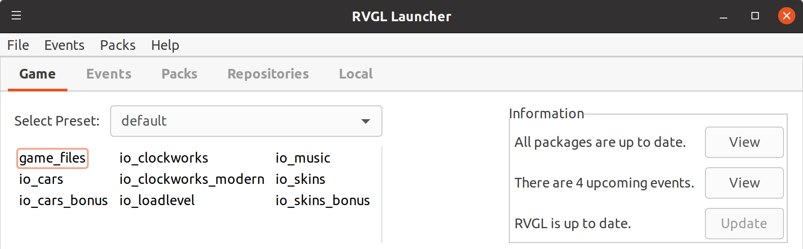
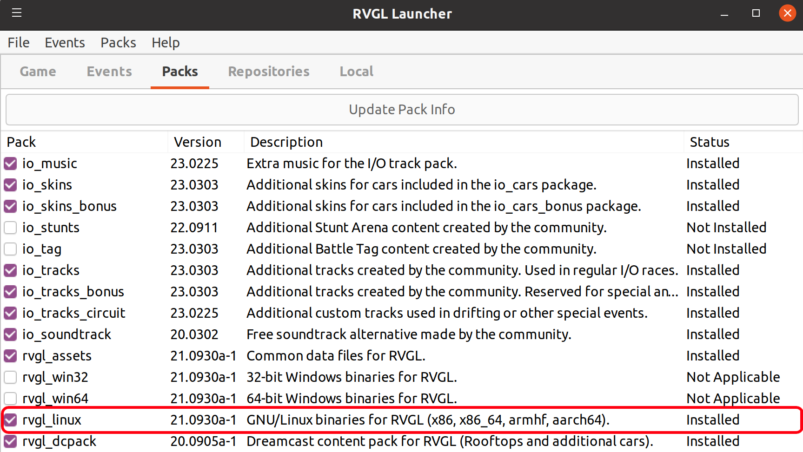
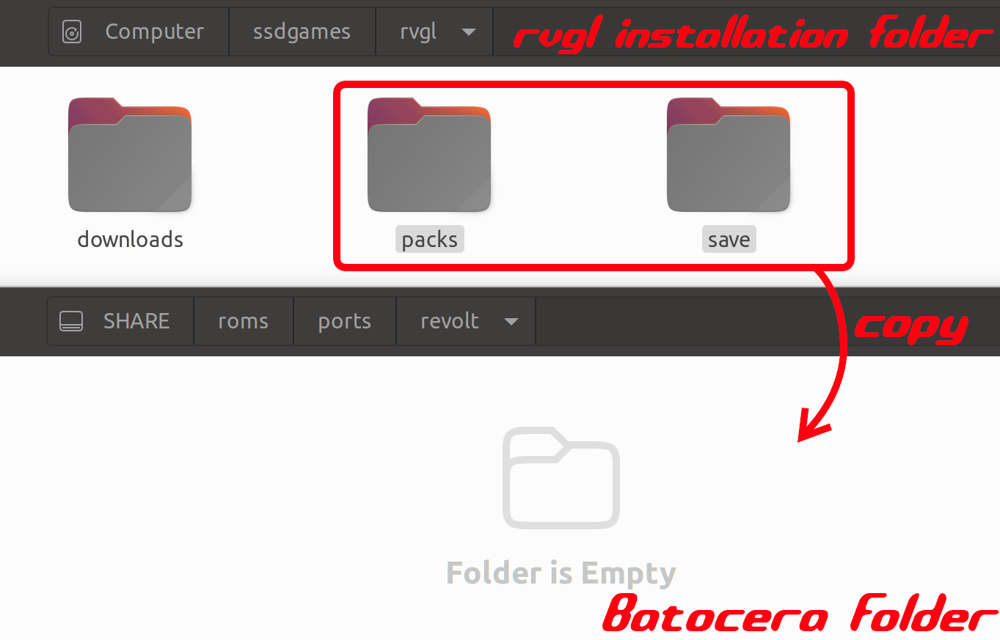
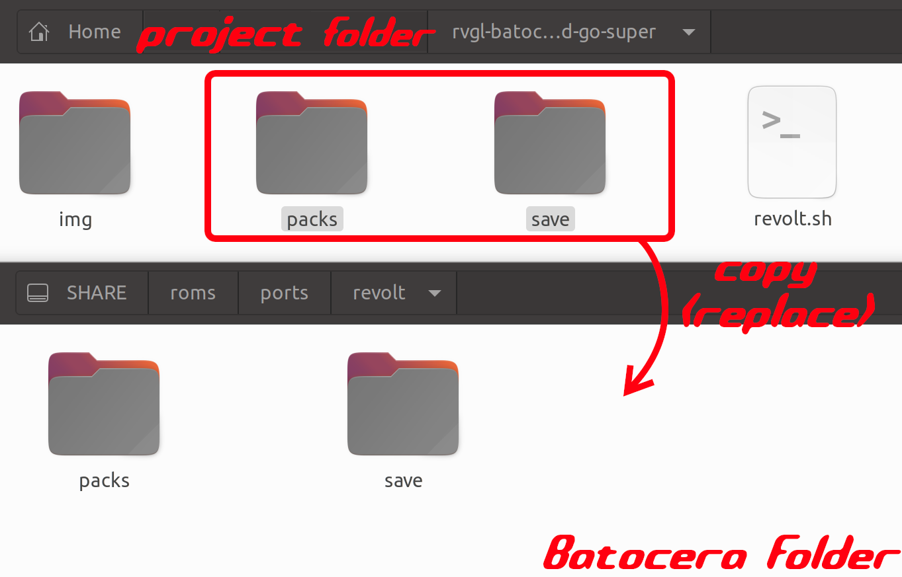
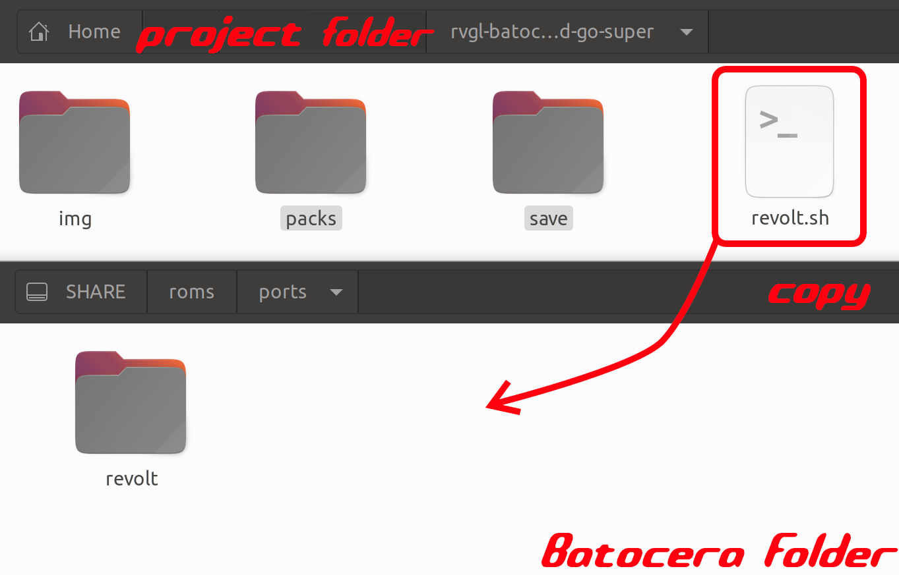

# How to run RVGL (Re-Volt) on Batocera on Odroid Go Super

## Clone the project

```
git clone
```

## Install locally RVGL Launcher
- Install RVGL Launcher on your local machine:
https://re-volt.gitlab.io/rvgl-launcher/

## Download the game
- Thanks to RVGL Launcher install the game locally



- Install the Pack `rvgl_linux`



## Install RVGL on batocera SHARE
- Create a directory `roms/ports/revolt` under `SHARE`
- Copy `packs` and `save` directories from your local installation to `rvgl` you created previously



- Copy `packs` and `save` directories from the project to `revolt` (replace files)



- Copy `revolt.sh` to `roms/ports` under `SHARE`



## Play on your Console

Warning: the startup is slow, the screen will be black for few minutes, be patient

## Supported Batocera versions:
- Batocera 36
- Batocera 35